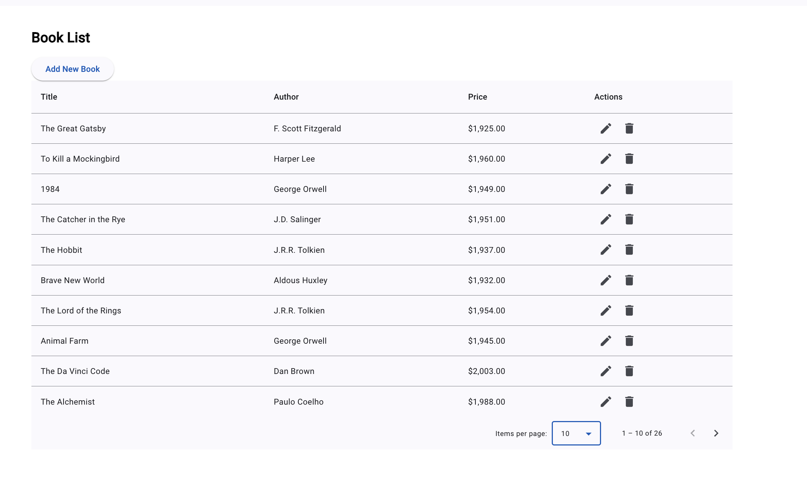
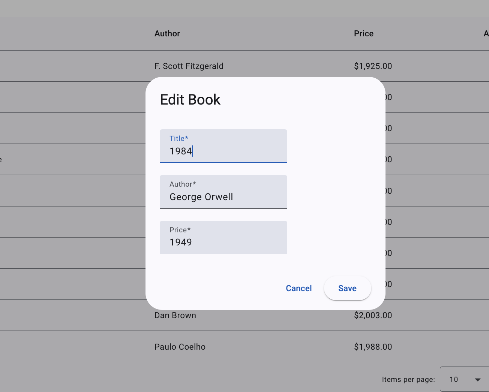
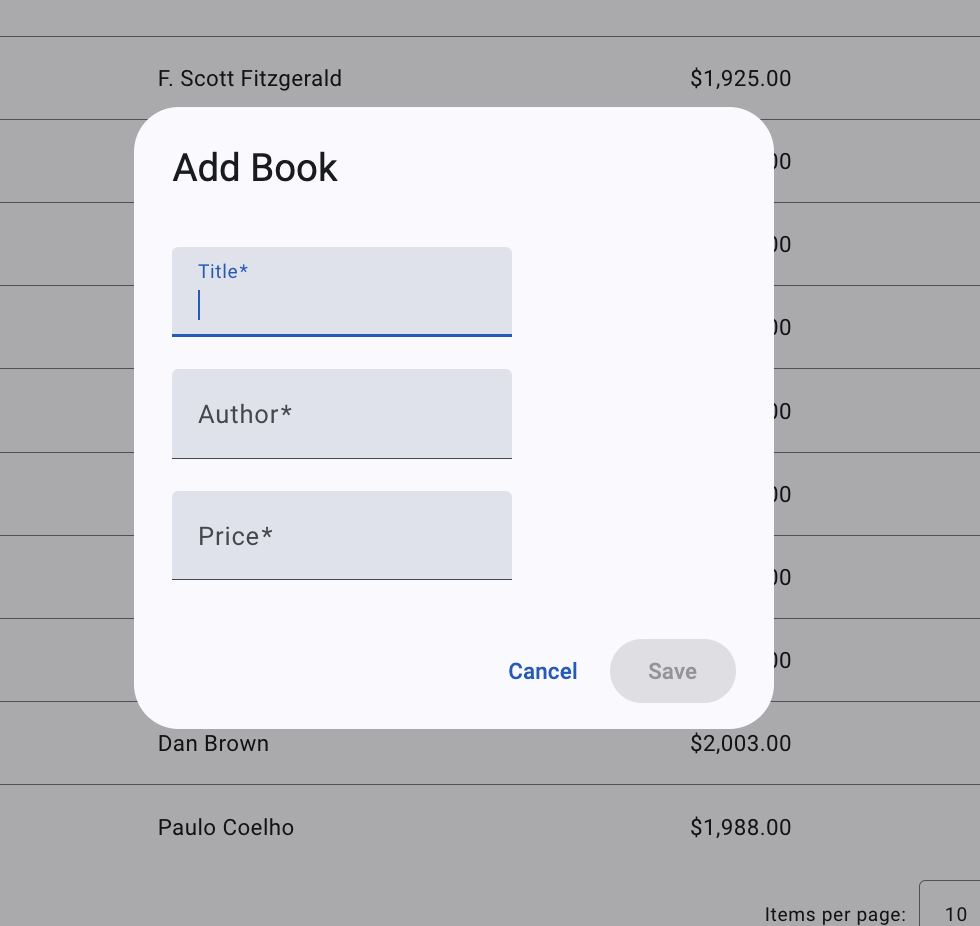

### FrontEnd README

## How to Make the Project Runnable

    1: Configure the server URL in book.service.ts file.
    2: Install the dependencies.
    3: To run server execute ng serve

By following the above steps we can configure and run the Frontend.

## Recommended Improvements

    1: Need to add the test.
    2: May be search can be a good featre as well

## Things That Were Not Tested

    1: I tested all the features need to add test cases for the frontend.

## How to Deploy on AWS

Deploying the backend application on AWS can be accomplished using the following approaches:
1: GitHub Actions for CI/CD:
_ Set up a CI/CD pipeline using GitHub Actions to automate deployments.
_ Configure AWS credentials and deployment scripts in the GitHub Actions workflow file.
2: Manual Deployment: \* Package the application and upload it to S3 and cloud front and rout 53 can be configured.

### UI

Home page

Update book

Add new book

